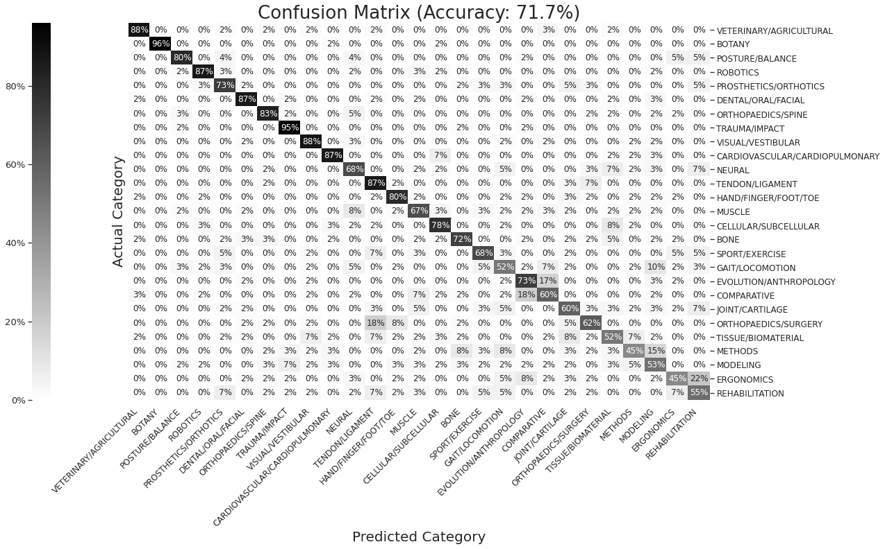

# BiomchBERT 
## Using Google's BERT neural network to categorize biomechanics publications

 *BiomchBERT has a prediction accuracy of 72% across 27 categories (tested on 1,600 publications)*

[Read about how BiomchBERT is helping the Biomechanics community!](https://www.ryan-alcantara.com/projects/p88_BiomchBERT/)
Source code for BiomchBERT can be found
[here](Construct_Models/BERT_lit_up.ipynb). Weekly Literature Updates are posted [here](https://biomch-l.isbweb.org/forum/biomch-l-forums/literature-update).
BiomchBERT (1.1 GB) and the training data is archived at [Zenodo](https://zenodo.org/record/4356055) due to GitHub file size limitations. *Will be updated 1/13/2021*

## Major Dependencies
* [BERT trained on MEDLINE/PubMed](https://tfhub.dev/google/experts/bert/pubmed/2)
* [Tensorflow](https://www.tensorflow.org/install)
* [Biopython](https://biopython.org/wiki/Download)
* [BeautifulSoup](https://www.crummy.com/software/BeautifulSoup/bs4/doc/)

## Contributors
- Ryan Alcantara ([twitter](https://twitter.com/Ryan_Alcantara_) // [website](https://ryan-alcantara.com) // [github](https://github.com/alcantarar)) 
- Gary Bruening ([twitter](https://twitter.com/garebearbru) // [website](https://gbruening.github.io/) // [github](https://github.com/GBruening))

Read about the early attempt to automate the Biomch-L Literature Update [here.](https://ryan-alcantara.com/projects/p98_literature/)

You can support this and my other projects by clicking the ["sponsor"](https/github.com/sponsor/alcantarar) button on the sidebar!
